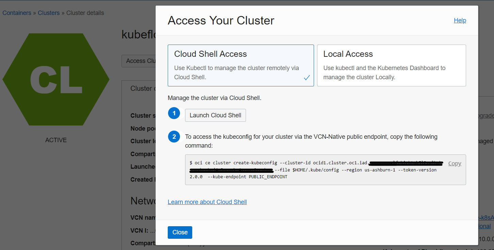

# Deploying LLMs using HuggingFace and Kubernetes on OCI Container Engine for Kubernetes (OKE)

[](https://img.shields.io/badge/license-UPL-green)<!--[](https://sonarcloud.io/dashboard?id=oracle-devrel_oci-k8s-hf-inference)-->

## Introduction

Large language models (LLMs) have made significant strides in text generation, problem-solving, and following instructions. As businesses integrate LLMs to develop cutting-edge solutions, the need for scalable, secure, and efficient deployment platforms becomes increasingly imperative. Kubernetes has risen as the preferred option for its scalability, flexibility, portability, and resilience.

In this demo, we demonstrate how to deploy fine-tuned LLM inference containers on Oracle Container Engine for Kubernetes (OKE), an OCI-managed Kubernetes service that simplifies deployments and operations at scale for enterprises. This service enables them to retain the custom model and datasets within their own tenancy without relying on a third-party inference API.

We will use Text Generation Inference (TGI) as the inference framework to expose the Large Language Models.

Check out the demo [here](TODO LINK)

### HuggingFace text generation inference

Text generation inference (TGI) is an open source toolkit available in containers for serving popular LLMs. The example fine-tuned model in this post is based on Llama 2, but you can use TGI to deploy other open source LLMs, including Mistral, Falcon, BLOOM, and GPT-NeoX. TGI enables high-performance text generation with various optimization features supported on multiple AI accelerators, including NVIDIA GPUs with `CUDA 12.2+`:

### GPU memory consideration

The GPU memory requirement is largely determined by the pretrained LLM's size.

For example, `Llama-2-7B` (7 billion parameters) loaded in *16-bit* precision requires 7 billion * 2 bytes (16 bits / 8 bits/byte) = 14 GB for the model weights.

**Quantization** is a technique used to reduce model size and improve inferencing performance by decreasing precision without significantly sacrificing accuracy. In this example, we use the quantization feature of TGI to load a fine-tuned model based on Llama 2 13B in 8-bit precision and fit it on `VM.GPU.A10.1` (single NVIDIA A10 Tensor Core GPU with 24-GB VRAM).

The following image depicts the real memory utilization after the inference container loads the quantized model. Alternatively, consider employing a smaller model, opting for a GPU instance with larger memory capacity, or selecting an instance with multiple GPUs, such as `VM.GPU.A10.2` (2x NVIDIA A10 GPUs), to prevent CUDA out-of-memory errors. By default, TGI shards across and uses all available GPUs to run the model:


### Deploying the LLM container on OKE

These are the instructions we will perform in this demo:


0. (Optional) Take one of the pretrained LLMs from HuggingFace model hub, such as `Meta Llama2 13B`, and fine-tune it with a targeted dataset on an [OCI NVIDIA GPU Compute instance](https://www.oracle.com/cloud/compute/gpu/#choice?source=:so:ch:or:awr::::). You can refer [to this AI solution](https://github.com/oracle-devrel/oci-genai-finetuning) to learn how to do finetuning if you're particularly interested in this step.

1. Save the customized LLM locally and upload it to OCI Object Storage, to store it as a model repository.

2. Deploy an OKE cluster and create a node pool consisting of `VM.GPU.A10.1` compute instances, powered by NVIDIA A10 Tensor Core GPUs (or any other Compute instance you want). OKE offers worker node images with **preinstalled NVIDIA GPU drivers**.

3. Install NVIDIA device plugin for Kubernetes, a DaemonSet that allows you to run GPU enabled containers in the Kubernetes cluster.

4. Build a Docker image for the `model-downloader` container to pull model files from Object Storage service. (The previous session provides more details.)

5. Create a Kubernetes deployment to roll out the TGI containers and `model-downloader` container. To schedule the TGI container on GPU, specify the resources limit using `“nvidia.com/gpu.”` Run `model-downloader` as Init Container to ensure that TGI container only starts after the successful completion of model downloads.

6. Create a Kubernetes service of type `Loadbalancer`. OKE will automatically spawn an OCI load balancer to expose the TGI application API to the Internet, allowing us to consume it wherever we want in our AI applications.

7. To interact with the model, you can use `curl` to send a request to `<Load Balancer IP address>:<port>/generate`, or deploy an inference client, such as Gradio, to observe your custom LLM in action. We also prepared [this Python script](./scripts/python_inference.py) to run requests against the model with Python.

## 0. Prerequisites & Docs

### Prerequisites

- An OCI tenancy with available credits to spend, and access to NVIDIA A10 Tensor Core GPU(s).
- A registered and verified HuggingFace account with a valid Access Token

### Docs

For more information, see the following resources:

- [HuggingFace text generation inference](http://https://github.com/huggingface/text-generation-inference)
- [NVIDIA device plugin for Kubernetes](https://github.com/NVIDIA/k8s-device-plugin#deployment-via-helm)
- [HuggingFace model hub](https://huggingface.co/models)
- [OCI Container Engine for Kubernetes (OKE)](https://www.oracle.com/cloud/cloud-native/container-engine-kubernetes/)
- [OCI Container Registry](https://docs.oracle.com/en-us/iaas/Content/Registry/Concepts/registryoverview.htm)
- [Kubernetes GPU scheduling](https://kubernetes.io/docs/tasks/manage-gpus/scheduling-gpus/)
- [NVIDIA GPU instances on OCI](https://www.oracle.com/cloud/compute/gpu/)

## Getting started

### Fine-Tuning the Model Locally

Firstly, install the required libraries like transformers and torch. You may need to set up a Python environment beforehand. Then, write a script to fine-tune the model using the provided dataset.

```python
from transformers import AutoModelForCausalLM, AutoTokenizer, Trainer, TrainingArguments
import torch

model = AutoModelForCausalLM.from_pretrained("EleutherAI/meta-llama2-13B")
tokenizer = AutoTokenizer.from_pretrained("EleutherAI/meta-llama2-13B")

training_args = TrainingArguments(output_dir="./fine-tuned", num_train_epochs=5)
trainer = Trainer(model=model, args=training_args, tokenizer=tokenizer)

trainer.train()
model.save_pretrained("./fine-tuned")
```

This will save the fine-tuned model into `./fine-tuned` directory.

### Upload the Model to OCI Object Storage

Create a bucket in OCI Object Storage and upload the fine-tuned folder there. Note down the URL for future reference.

### Create & Access OKE Cluster

To create an OKE Cluster, we can perform this step through the OCI Console:


And wait for the creation of the cluster, it'll take around 5 minutes.

> You will be able to access this cluster however you want. It's recommended to use OCI Cloud Shell to access and connect to the cluster, as all OCI configuration is performed automatically. If you still want to use a Compute Instance or your own local machine, you will need to set up authentication to your OCI tenancy. Also, you must have downloaded and installed `OCI CLI version 2.24.0` (or later) and configured it for use. If your version of the OCI CLI is earlier than version `2.24.0`, download and install a newer version from here.

After the cluster has been provisioned, to get access into the OKE cluster, follow these steps.

1. Click Access Cluster on the `Cluster details` page:

    

2. Accept the default Cloud Shell Access and click Copy to copy the `oci ce cluster create-kubeconfig ...` command.

3. To access the cluster, paste the command into your Cloud Shell session and hit Enter.

4. Verify that the `kubectl` is working by using the `get nodes` command:

    ```bash
    kubectl get nodes
    ```

5. Repeat this command multiple times until all three nodes show `Ready` in the `STATUS` column:

    When all nodes are `Ready`, your OKE installation has finished successfully.

### Prepare the Custom Image

Build a Dockerfile containing all dependencies needed for serving the model.This includes installing necessary packages, copying over the saved model and setting up the entrypoint script. Here's an example Dockerfile:

```docker
FROM python:3.8-slim
RUN pip install --no-cache-dir torch transformers flask gunicorn gevent
COPY ./fine-tuned /app/fine-tuned
WORKDIR /app
EXPOSE 8080
ENTRYPOINT ["sh","entrypoint.sh"]
```

In the same directory, prepare an entrypoint script (entrypoint.sh) which sets up the Flask server:

```bash
#!/bin/bash
export MODEL_PATH="/app/fine-tuned/"
exec gunicorn --bind 0.0.0.0:$PORT --workers $NUM_WORKERS app:server
```

Finally, build the Docker image and push it to the OCI Registry:

- `docker login <region>.ocir.io`
- `docker build . -t <tenant>/<repo>:latest`
- `docker tag <tenant>/<repo>:latest <region>.ocir.io/<tenant>/<repo>:latest`
- `docker push <region>.ocir.io/<tenant>/<repo>:latest`

### Deployment

Now we need to create a Kubernetes deployment file. An example YAML file could look something like this:

```yaml
apiVersion: apps/v1
kind: Deployment
metadata:
  labels:
    app: tgi
  name: tgi
spec:
  replicas: 1
  selector:
    matchLabels:
      app: tgi
  template:
    metadata:
      annotations:
        nvidia.com/gpus: "1"
      creationTimestamp: null
      labels:
        app: tgi
    spec:
      containers:
      - env:
        - name: MODEL_URL
          value: https://objectstorage.<region>.oraclecloud.com/n/<namespace>/b/<bucket>/o/path/to/your/saved/model
        image: <tenant>/<repo>:latest
        name: tgi
        ports:
        - containerPort: 8080
          protocol: TCP
        resources:
          limits:
            nvidia.com/gpu: "1"
      initContainers:
      - name: model-downloader
        image: oraclelinux:7-slim
        command: ['curl', '-fsSL', '${MODEL_URL}']
        volumeMounts:
        - mountPath: "/app/fine-tuned"
          name: model-volume
      volumes:
      - emptyDir: {}
        name: model-volume
```

Apply the deployment:

```bash
kubectl apply -f deployment.yml
```

### Expose the Service

Expose the deployed service through a LoadBalancer:

```yaml
apiVersion: v1
kind: Service
metadata:
  name: tgi
spec:
  ports:
  - port: 80
    targetPort: 8080
    protocol: TCP
    name: http
  selector:
    app: tgi
  type: LoadBalancer
```

Apply the service:

```bash
kubectl apply -f service.yml
```

Get the external IP address assigned to the Load Balancer:

```bash
kubectl get svc
```

Use this IP address along with /generate endpoint to send requests to the model.

```bash
curl <external IP address>:8080/generate_stream \
    -X POST \
    -d '{"inputs":"What is Deep Learning?","parameters":{"max_new_tokens":50}}' \
    -H 'Content-Type: application/json'
```

## Text Generation Inference (TGI) & Hardware Specs

To install TGI on the OKE cluster, run the following command:

```bash
model=HuggingFaceH4/zephyr-7b-beta # huggingface model's repository (model_creator_name/model_name) (can be any model)
volume=$PWD/data # share a volume with the Docker container to avoid downloading weights every run

docker run --gpus all --shm-size 1g -p 8080:80 -v $volume:/data ghcr.io/huggingface/text-generation-inference:2.0 --model-id $model
```

> To see all possible deploy flags and options, you can use the `--help` flag. It’s possible to configure the number of shards, quantization, generation parameters, and more.

This will setup whichever model from HF you want, as long as the repository is well-formed and contains the necessary files.

After the container has been pulled, you can make requests via an API to `/generate_stream` to localhost (from within the container) or to `<Load Balancer IP address>:<port>/generate`:

```bash
curl 127.0.0.1:8080/generate_stream \
    -X POST \
    -d '{"inputs":"What is Deep Learning?","parameters":{"max_new_tokens":50}}' \
    -H 'Content-Type: application/json'
```

> [Here](https://huggingface.github.io/text-generation-inference/) is a full API specification for all callable endpoints.

We've also pulled a Python script [here](./scripts/python_inference.py) if you'd rather make the requests programatically using Python.

##
https://cloudmarketplace.oracle.com/marketplace/en_US/listing/165104541

## Model loading

TGI supports loading models from HuggingFace model hub or locally. To retrieve a custom LLM from the OCI Object Storage service, we created a Python script using the OCI Python software developer SDK, packaged it as a container, and stored the Docker image on the OCI Container Registry. This `model-downloader` container runs before the initialization of TGI containers. It retrieves the model files from Object Storage and stores them on the `emptyDir` volumes, enabling sharing with TGI containers within the same pod.

## Conclusion

Deploying a production-ready LLM becomes straightforward when using the HuggingFace TGI container and OKE. This approach allows you to harness the benefits of Kubernetes without the complexities of deploying and managing a Kubernetes cluster. The customized LLMs are fine-tuned and hosted within your Oracle Cloud Infrastructure tenancy, offering complete control over data privacy and model security.

## Contributing

<!-- If your project has specific contribution requirements, update the
    CONTRIBUTING.md file to ensure those requirements are clearly explained. -->

This project welcomes contributions from the community. Before submitting a pull
request, please [review our contribution guide](./CONTRIBUTING.md).

## Security

Please consult the [security guide](./SECURITY.md) for our responsible security
vulnerability disclosure process.

## License

Copyright (c) 2024 Oracle and/or its affiliates.

Licensed under the Universal Permissive License (UPL), Version 1.0.

See [LICENSE](LICENSE.txt) for more details.

ORACLE AND ITS AFFILIATES DO NOT PROVIDE ANY WARRANTY WHATSOEVER, EXPRESS OR IMPLIED, FOR ANY SOFTWARE, MATERIAL OR CONTENT OF ANY KIND CONTAINED OR PRODUCED WITHIN THIS REPOSITORY, AND IN PARTICULAR SPECIFICALLY DISCLAIM ANY AND ALL IMPLIED WARRANTIES OF TITLE, NON-INFRINGEMENT, MERCHANTABILITY, AND FITNESS FOR A PARTICULAR PURPOSE.  FURTHERMORE, ORACLE AND ITS AFFILIATES DO NOT REPRESENT THAT ANY CUSTOMARY SECURITY REVIEW HAS BEEN PERFORMED WITH RESPECT TO ANY SOFTWARE, MATERIAL OR CONTENT CONTAINED OR PRODUCED WITHIN THIS REPOSITORY. IN ADDITION, AND WITHOUT LIMITING THE FOREGOING, THIRD PARTIES MAY HAVE POSTED SOFTWARE, MATERIAL OR CONTENT TO THIS REPOSITORY WITHOUT ANY REVIEW. USE AT YOUR OWN RISK.
